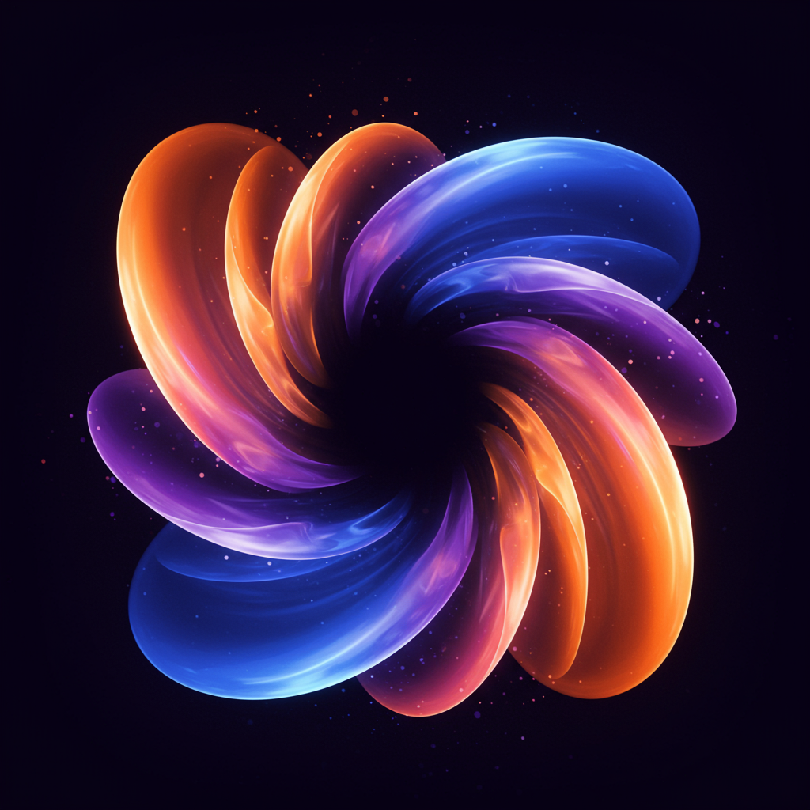

# Lumina Photo Gallery

<div align="center">



**A beautiful, modern photo gallery web application built with Next.js 15.5**

</div>

> ⚠️ **VIBE CODING WARNING**
> 
> This project is a "VIBE CODING" app. Expect experimental, whimsical design choices and rapidly changing APIs. Use for inspiration and fun; not guaranteed production-ready.

*Designed for photographers and photo enthusiasts to organize and share their work*

[](https://nextjs.org/)
[](https://www.typescriptlang.org/)
[](https://www.prisma.io/)
[](LICENSE)

[Demo](https://lumina-demo.example.com) • [Documentation](docs/) • [Contributing](CONTRIBUTING.md) • [Issues](https://github.com/username/lumina/issues)

## ✨ Features

### 🖼️ Photo Management
- **Smart Organization**: Automatic album discovery through file system scanning
- **Nested Albums**: Support for hierarchical album structures
- **EXIF Data**: Automatic extraction and display of photo metadata
- **Multiple Formats**: Support for JPG, PNG, and RAW files
- **Bulk Operations**: Process hundreds to thousands of photos efficiently

### 🚀 Performance & Storage
- **S3 Integration**: Compatible with AWS S3, MinIO, DigitalOcean Spaces
- **Smart Thumbnails**: Automatic generation in 3 sizes (300px, 800px, 1200px)
- **Background Processing**: Async thumbnail and blurhash generation
- **Optimized Loading**: Lazy loading with blurhash placeholders
- **Concurrent Processing**: Configurable batch processing (1-12 photos)

### 🎨 User Experience
- **Responsive Design**: Mobile-first approach with touch-friendly interactions
- **Photo Lightbox**: Full-screen viewing with keyboard navigation
- **Favorites System**: LocalStorage-based photo bookmarking
- **Advanced Sorting**: Sort by date taken, filename, or custom criteria
- **Search & Filter**: Find photos quickly with powerful filtering
- **Download Options**: Single photos or entire albums as ZIP files

### 🔧 Admin Features
- **Dashboard**: Comprehensive admin panel with real-time statistics
- **Job Monitoring**: Track thumbnail generation and sync operations
- **Album Management**: Public/private visibility controls
- **Background Tasks**: Scheduled sync at 3AM with manual triggers
- **Error Handling**: Detailed logging and error recovery
- **Settings**: Configurable batch sizes and processing options

### 🌐 Technical Excellence
- **Modern Stack**: Next.js 15.5 with App Router and TypeScript
- **Database**: SQLite with Prisma ORM (PostgreSQL migration ready)
- **Authentication**: NextAuth.js integration for secure admin access
- **UI Components**: Beautiful UI with Tailwind CSS and shadcn/ui
- **Internationalization**: Multi-language support with next-intl

## 🚀 Quick Start

### Prerequisites

- Node.js 18+ 
- npm or yarn
- S3-compatible storage (AWS S3, MinIO, etc.)
- Git

### Installation

1. **Clone the repository**
   ```bash
   git clone https://github.com/username/lumina-photo-gallery.git
   cd lumina-photo-gallery
   ```

2. **Install dependencies**
   ```bash
   npm install
   ```

3. **Set up environment variables**
   ```bash
   cp .env.example .env.local
   ```
   
   Edit `.env.local` with your configuration:
   ```env
   # Database
   DATABASE_URL="file:./dev.db"
   
   # S3 Configuration
   S3_ENDPOINT="https://s3.amazonaws.com"
   S3_BUCKET="your-photo-bucket"
   S3_ACCESS_KEY="your-access-key"
   S3_SECRET_KEY="your-secret-key"
   S3_REGION="us-east-1"
   
   # Authentication
   NEXTAUTH_SECRET="your-secure-secret"
   NEXTAUTH_URL="http://localhost:3000"
   ADMIN_EMAIL="admin@example.com"
   ADMIN_PASSWORD="secure-password"
   
   # File System
   PHOTOS_ROOT_PATH="/path/to/your/photos"
   ```

4. **Initialize the database**
   ```bash
   npx prisma generate
   npx prisma db push
   ```

5. **Start the development server**
   ```bash
   npm run dev
   ```

6. **Access the application**
   - Gallery: http://localhost:3000
   - Admin: http://localhost:3000/admin

## 📁 Project Structure

```
lumina/
├── app/                    # Next.js App Router
│   ├── (admin)/           # Admin dashboard routes
│   ├── (public)/          # Public gallery routes
│   ├── api/               # API endpoints
│   └── globals.css        # Global styles
├── components/            # React components
│   ├── Gallery/           # Photo display components
│   ├── Admin/             # Admin interface components
│   ├── Favorites/         # Favorites functionality
│   └── ui/                # shadcn/ui components
├── lib/                   # Core utilities
│   ├── thumbnails.ts      # Image processing
│   ├── s3.ts             # Storage operations
│   ├── prisma.ts         # Database client
│   └── auth.ts           # Authentication
├── prisma/               # Database schema & migrations
├── scripts/              # Utility scripts
└── messages/             # Internationalization
```

## 🛠️ Configuration

### Environment Variables

| Variable | Description | Default |
|----------|-------------|---------|
| `DATABASE_URL` | SQLite database path | `file:./dev.db` |
| `S3_ENDPOINT` | S3-compatible endpoint | Required |
| `S3_BUCKET` | Storage bucket name | Required |
| `PHOTOS_ROOT_PATH` | Local photos directory | Required |
| `SYNC_CRON` | Background sync schedule | `0 3 * * *` |

### Album Management

Place a `project.md` file in any photo directory to add descriptions:

```markdown
# Wedding Photography Session
Beautiful moments captured during Sarah & John's wedding ceremony.
```

## 🔧 Development

### Available Scripts

```bash
npm run dev          # Start development server
npm run build        # Build for production
npm run start        # Start production server
npm run lint         # Run ESLint
npm run db:generate  # Generate Prisma client
npm run db:push      # Push schema to database
npm run db:studio    # Open Prisma Studio
```
```

### Adding New Features

1. **API Routes**: Add to `app/api/`
2. **Components**: Use TypeScript and follow existing patterns
3. **Database**: Update `prisma/schema.prisma` and run migrations
4. **Styling**: Use Tailwind CSS classes and shadcn/ui components

## 📚 API Documentation

### Public Endpoints

- `GET /api/albums` - List public albums
- `GET /api/albums/[...path]` - Get album details and photos
- `GET /api/photos/[id]/serve` - Serve photo with size parameter

### Admin Endpoints

- `POST /api/admin/sync` - Trigger photo synchronization
- `POST /api/admin/thumbnails` - Start thumbnail generation
- `PUT /api/admin/albums/[id]` - Update album settings

## 🚀 Deployment

### Vercel (Recommended)

1. Fork this repository
2. Connect to Vercel
3. Add environment variables
4. Deploy!

### Docker (Production Ready)

Lumina supports both development and production Docker deployments with multi-stage builds.

**Development (with hot reloading):**
```bash
docker compose -f docker-compose.dev.yml up
```

**Production:**
```bash
# Setup environment
cp .env.docker .env
# Edit .env with your configuration

# Deploy all services
docker-compose -f docker-compose.prod.yml up -d

# Initialize database
docker-compose -f docker-compose.prod.yml exec app npm run db:push
```

**📖 Complete Guide:** See [DEPLOYMENT.md](DEPLOYMENT.md) for detailed instructions, configuration options, and production deployment strategies.

**Services Included:**
- Next.js application (dev: hot reloading, prod: optimized standalone)
- PostgreSQL database
- Redis for queues
- Thumbnail generation workers
- Blurhash generation workers
- EXIF extraction workers
- Upload/sync workers

### Traditional Hosting

1. Build the project: `npm run build`
2. Upload `dist/` directory
3. Configure environment variables
4. Start with: `npm start`

## 🤝 Contributing

We welcome contributions! Please see our [Contributing Guide](CONTRIBUTING.md) for details.

### Development Setup

1. Fork the repository
2. Create a feature branch: `git checkout -b feature/amazing-feature`
3. Make your changes
4. Run tests: `npm test`
5. Commit changes: `git commit -m 'Add amazing feature'`
6. Push to branch: `git push origin feature/amazing-feature`
7. Open a Pull Request

### Reporting Issues

Found a bug? Have a feature request? Please [open an issue](https://github.com/username/lumina/issues) with:

- Clear description of the problem
- Steps to reproduce
- Expected vs actual behavior
- Screenshots if applicable
- Environment details

## 📊 Performance

- **Scalability**: Handles thousands of photos per album
- **Optimization**: Automatic image optimization and lazy loading
- **Caching**: Intelligent caching strategies for optimal performance
- **Background Jobs**: Non-blocking thumbnail generation

## 🔒 Security

- **Authentication**: Secure admin access with NextAuth.js
- **Input Validation**: All user inputs are sanitized
- **File Security**: Safe file path handling and validation
- **Environment**: Secure environment variable management

## 🌍 Roadmap

### Version 2.0
- [ ] User accounts and permissions
- [ ] Advanced search with AI tagging
- [ ] Mobile app (React Native)
- [ ] Social sharing integration
- [ ] Comments and ratings

### Version 1.x
- [x] Basic photo gallery ✅
- [x] Admin dashboard ✅
- [x] Thumbnail generation ✅
- [x] S3 integration ✅
- [ ] Video support
- [ ] Watermarking
- [ ] Analytics dashboard

## 📄 License

This project is licensed under the MIT License - see the [LICENSE](LICENSE) file for details.

## 🙏 Acknowledgments

- [Next.js](https://nextjs.org/) - The React framework for production
- [Prisma](https://prisma.io/) - Next-generation ORM
- [Sharp](https://sharp.pixelplumbing.com/) - High performance image processing
- [shadcn/ui](https://ui.shadcn.com/) - Beautiful UI components
- [Tailwind CSS](https://tailwindcss.com/) - Utility-first CSS framework

## 💬 Support

- 📖 [Documentation](docs/)
- 💬 [Discussions](https://github.com/jcalado/lumina/discussions)
- 🐛 [Issues](https://github.com/jcalado/lumina/issues)
- 📧 [Email](mailto:me@jcalado.com)

---

<div align="center">

**Built with ❤️ by Joel Calado**

[Website](https://jcalado.com) • [Demo](https://demo.lumina-gallery.com) • [Sponsor](https://github.com/sponsors/jcalado)

</div>

